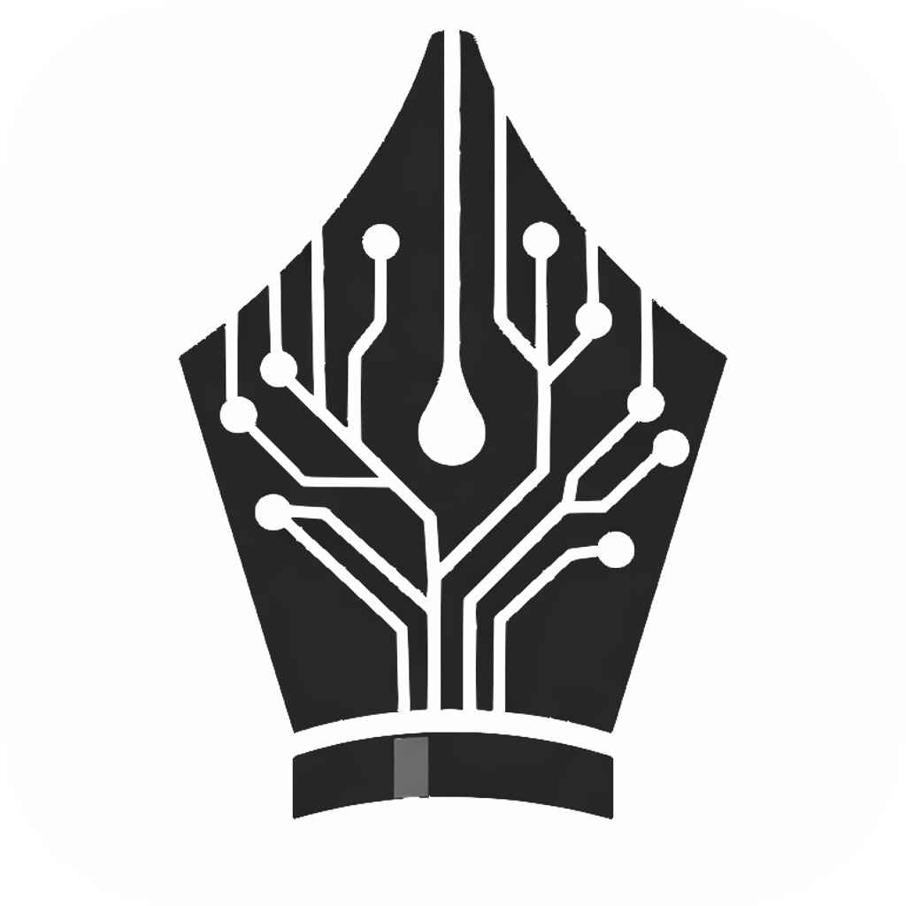
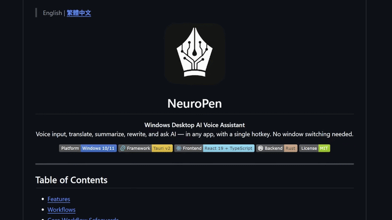
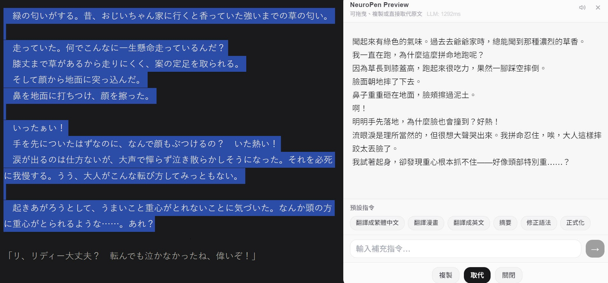
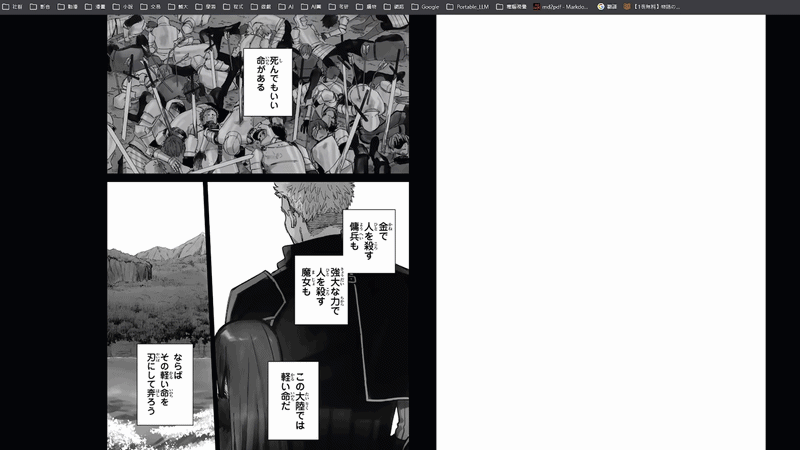

> **[English](./README.md)** | 繁體中文

<p align="center">
  
</p>

<h1 align="center">NeuroPen</h1>

<p align="center">
  <strong>Windows 桌面 AI 語音全能助手</strong><br/>
  在任何應用程式中，按一個快捷鍵就能語音輸入、翻譯、摘要、改寫、問答 — 不需要切換視窗。
</p>

<p align="center">
  
  
  
  
  
</p>

<p align="center">
  
</p>

---

## Table of Contents / 目錄

- [Features / 功能特色](#features--功能特色)
- [Workflows / 工作流](#workflows--工作流)
- [Core Workflow Safeguards / 核心流程保護](#core-workflow-safeguards--核心流程保護)
- [UI Modules / 介面模組](#ui-modules--介面模組)
- [Supported Models / 支援模型](#supported-models--支援模型)
- [Getting Started (Users) / 使用者快速開始](#getting-started-users--使用者快速開始)
- [Getting Started (Developers) / 開發者指南](#getting-started-developers--開發者指南)
- [Project Structure / 專案結構](#project-structure--專案結構)
- [Configuration / 設定說明](#configuration--設定說明)
- [Community & Roadmap / 社群與路線圖](#community--roadmap--社群與路線圖)
- [CI/CD & Release / 自動化發佈](#cicd--release--自動化發佈)
- [Troubleshooting / 疑難排解](#troubleshooting--疑難排解)
- [Security & Privacy / 安全與隱私](#security--privacy--安全與隱私)
- [License / 授權](#license--授權)

---

## Features / 功能特色

| 領域 | 目前能力 |
|------|----------|
| **全域語音擷取** | 長按 `Alt + 反引號`，可在任何應用程式錄音並轉寫 |
| **工作流分流（語音輸入 / 快捷指令 / 選取語音指令 / 助理對話）** | 依「是否有選字」與「是否偵測喚醒詞」自動路由 |
| **劃詞快速操作** | 選字後顯示 Quick Action 浮動操作，支援可自訂預設指令 |
| **選字語音指令** | 對選取文字口述修改需求，交由 LLM 重寫 |
| **助理對話** | 喚醒詞問答流程，支援串流回覆 |
| **輸出策略** | 可選 `PreviewStream` 預覽視窗或直接注入到焦點輸入框 |
| **安全注入 + 復原** | 注入前驗證焦點視窗，並支援 `Alt + Z` 一鍵復原 |
| **STT 引擎管線** | 支援 OpenAI Whisper API，以及本地 Whisper、SenseVoice、Moonshine |
| **本地 STT 模型管理** | 支援本地 STT 模型安裝/切換/刪除、下載進度與取消 |
| **多 LLM 提供商** | OpenAI、Gemini、Claude、Grok、Qwen、豆包、DeepSeek、Ollama |
| **截圖多模態流程** | `Alt + S` 區域截圖後可直接進入 LLM 圖像問答流程 |
| **TTS 朗讀** | 內建 Piper TTS，支援安裝/切換/刪除、模型路徑 / 語速 / speaker id 設定 |
| **歷史紀錄控制** | 本地歷史紀錄（最多 200 筆） |
| **應用程式設定檔** | 依前景應用程式自動套用語調、提示詞、語言、輸出模式與直接貼上設定 — 關鍵字首配對勝出 |
| **操作設定** | 開機啟動、麥克風來源、快捷鍵、語言偏好等 |
| **系統匣常駐** | 背景執行，從系統匣快速開啟設定或結束程式 |

---

## Workflows / 工作流

| 工作流 | 觸發條件 | 輸出 |
|------|----------|------|
| **語音輸入 (A)** | 無選字 + `Alt + 反引號` + 無喚醒詞 | STT 文字顯示於預覽視窗或直接注入游標位置 |
| **快捷指令 (B1)** | 有選字 + 點擊 Quick Action | LLM 結果顯示於預覽視窗 |
| **選取語音指令 (B2)** | 有選字 + `Alt + 反引號` + 口述指令 | LLM 改寫結果顯示於預覽視窗 |
| **助理對話 (C)** | 無選字 + 轉寫中偵測到喚醒詞 | LLM 回答顯示於預覽視窗或直接注入 |

### 工作流展示

**語音輸入 (A)**


**快捷指令 (B1)**


**選取語音指令 (B2)**


## Core Workflow Safeguards / 核心流程保護

NeuroPen 的注入流程採用固定保護機制，避免誤貼到錯誤視窗：

1. 鎖定前景視窗並暫存剪貼簿。
2. 執行 STT / LLM 處理。
3. 注入前再次驗證焦點視窗未變更。
4. 注入結果後還原原始剪貼簿。

若處理期間焦點改變，系統會取消注入並還原剪貼簿。

---

## UI Modules / 介面模組

- **Settings Window / 設定視窗**：包含 General、Voice & STT、Quick Actions、LLM、TTS、History、App Profiles 等設定分頁。
- **Quick Action Icon / 劃詞浮動操作**：選字後顯示可自訂預設指令與自訂輸入欄位。
- **Output Preview Window / 輸出預覽視窗**：支援串流輸出、追問、複製/取代，以及截圖附件預覽。
- **Recording Indicator / 錄音指示器**：顯示錄音狀態與秒數的輕量浮窗。
- **History Panel / 歷史紀錄面板**：本地紀錄的搜尋、複製與刪除操作。
- **Screenshot Overlay / 截圖區域選取層**：提供區域截圖並串接到圖像問答流程。
- **App Profiles / 應用程式設定檔**：以關鍵字匹配前景應用程式（如 Notion、VS Code、LINE），自動套用語調提示、額外提示詞、語言偏好、輸出模式與直接貼上設定。設定檔依優先順序排列，首個匹配者生效。

---

## Supported Models / 支援模型

### LLM Providers

| Provider | Type | Notes |
|----------|------|-------|
| OpenAI | Cloud | GPT-4o, GPT-4, GPT-3.5 等 |
| Gemini | Cloud | Google Gemini 系列 |
| Claude | Cloud | Anthropic Claude 系列 |
| Grok | Cloud | xAI Grok 系列 |
| Qwen | Cloud | 阿里通義千問 |
| 豆包 (Doubao) | Cloud | 字節跳動豆包 |
| DeepSeek | Cloud | DeepSeek 系列 |
| Ollama | Local | 本地執行，預設 `http://127.0.0.1:11434` |

### STT Engines

| Engine | Type | Notes |
|--------|------|-------|
| OpenAI Whisper API | Cloud | 需要 API Key |
| Local Whisper | Local | 透過 whisper-rs / whisper.cpp，支援 CPU 與 GPU (Vulkan) |
| SenseVoice | Local | 本地 STT，多語辨識，支援 zh/en/ja/ko/yue |
| Moonshine | Local | 輕量英文本地 STT，偏重速度 |

### Local Whisper Models

| Model | Size | Speed | Accuracy |
|-------|------|-------|----------|
| Whisper Small | ~461 MB | Fast | Good |
| Whisper Medium | ~1.5 GB | Medium | Better |
| Whisper Large | ~2.9 GB | Slow | Best |
| Whisper Turbo | ~1.5 GB | Fast | Better |

### 其他本地 STT 模型

| 模型 | 引擎 | 語言涵蓋 | 安裝形式 | 說明 |
|------|------|----------|----------|------|
| SenseVoice Small | SenseVoice | 中文、英文、日文、韓文、粵語 | 多檔 bundle | 非 Whisper 路線的多語本地辨識選項 |
| Moonshine Base | Moonshine | 英文 | 多檔 bundle | 速度快、體積輕量 |
| Moonshine Tiny | Moonshine | 英文 | 多檔 bundle | 最小的本地 STT 選項，偏向速度優先 |

本地 STT 補充：

- NeuroPen 的 STT 模型管理器支援安裝、取消下載、刪除與切換本地模型。
- STT 模型下拉選單只會顯示已安裝的本地模型。
- STT 語言選項支援 `auto`、`en`、`zh`、`ja`、`ko`、`de`、`fr`、`es`、`ru`、`ar`，但實際可用語言仍取決於你選的模型。

### TTS

| Engine | Notes |
|--------|-------|
| Piper TTS | 本地播放，支援模型路徑、語速與 speaker id 設定 |

### 內建 Piper 聲音

| 聲音 | 語言 | 品質 | Speakers | 說明 |
|------|------|------|----------|------|
| Huayan | zh-CN | medium | 1 | 繁中與簡中的預設中文女聲 |
| Lessac | en-US | medium | 1 | 自然語氣的英文助理聲音 |
| Thorsten | de-DE | medium | 1 | 德文男聲 |
| Siwis | fr-FR | medium | 1 | 法文單說話人聲音 |
| Sharvard | es-ES | medium | 2 | 可用 Speaker ID 切換的西文雙說話人聲音 |
| Irina | ru-RU | medium | 1 | 俄文單說話人聲音 |
| Kareem | ar-SA | medium | 1 | 阿拉伯文單說話人聲音 |

Piper TTS 補充：

- 內建 TTS 模型管理器支援安裝、取消下載、刪除與設為目前使用中。
- 仍可手動填入自訂 `.onnx` 模型路徑。
- Speaker ID 主要用在像 Sharvard 這類多說話人模型。

---

## Getting Started (Users) / 使用者快速開始

### System Requirements / 系統需求

- **OS**：Windows 10 (1809+) / Windows 11
- 麥克風
- （雲端模式）網路連線 + API Key
- （本地 STT）建議 8 GB+ RAM；支援 Vulkan 的 GPU 可加速（見下方相容列表），無 GPU 則自動使用 CPU

### GPU Acceleration / GPU 加速支援

本地 Whisper STT 透過 [Vulkan](https://www.vulkan.org/) 後端進行 GPU 加速，**不需要安裝任何額外驅動或 DLL** — 只要你的 GPU 驅動支援 Vulkan 即可。若 GPU 初始化失敗，通常會自動退回 CPU 執行。

| GPU 廠商 | 支援的顯卡 | 備註 |
|----------|-----------|------|
| **NVIDIA** | GeForce GTX 600 系列以上（Kepler+） | 驅動 496.76+ 建議 |
| **AMD** | Radeon HD 7700 系列以上（GCN 1.0+） | Radeon Software Adrenalin 驅動 |
| **Intel** | HD Graphics 520/530 以上（Skylake Gen9+）/ Arc 系列 | 內顯也支援 |

> **沒有獨立顯卡？** 大部分 2016 年後的 Intel 內顯都支援 Vulkan，仍可加速。完全不支援時通常會退回 CPU 執行。

### Installation / 安裝

1. 前往 [Releases](../../releases) 頁面下載最新 `.exe` 安裝檔
2. 執行安裝程式（NSIS installer）
3. 啟動 NeuroPen — 程式會常駐在系統匣

### First-Time Setup / 首次設定

1. 右鍵點擊系統匣圖示 → **設定**
2. **一般**：設定顯示語言、全域快捷鍵、喚醒詞
3. **LLM**：選擇 Provider、管理常用模型清單、設定輸出偏好語言、輸入 API Key（如 OpenAI）
4. **語音與 STT**：選擇 STT 模型、設定麥克風來源，並可安裝或切換本地 STT 模型
5. **TTS**：可選擇安裝 Piper 聲音、設為目前使用中，或保留手動 `.onnx` 路徑
6. 點「儲存」，即可開始使用

### Quick Usage / 快速上手

| 想做什麼 | 怎麼做 |
|----------|--------|
| 語音打字 | 在任何輸入框按 `Alt + 反引號` → 說話 → 放開 |
| 翻譯選字 | 選取文字 → 點浮動圖示 → 選「翻譯成英文」 |
| 語音改寫 | 選取文字 → 按快捷鍵 → 說「幫我改成正式語氣」 |
| 問 AI | 按快捷鍵 → 說「助理，幫我列出三個寫報告的技巧」 |
| 復原 | `Alt + Z` 還原上一次文字注入 |

---

## Getting Started (Developers) / 開發者指南

### Prerequisites / 環境需求

- [Node.js](https://nodejs.org/) 24.14.0（`.nvmrc`，npm 11.9.0）
- [Rust](https://www.rust-lang.org/) 1.93.1（`rust-toolchain.toml`）
- Windows 10/11
- [Tauri v2 prerequisites](https://v2.tauri.app/start/prerequisites/)
- （GPU 加速建置）[Vulkan SDK](https://vulkan.lunarg.com/sdk/home) — 僅編譯 `local-stt-gpu` 時需要

### Install & Run / 安裝與啟動

```bash
# Clone the repository
git clone https://github.com/your-username/NeuroPen.git
cd NeuroPen

# Verify your local toolchain matches the repo
npm run doctor

# Install frontend dependencies from the lockfile
npm ci

# Run in development mode (with hot-reload)
npm run tauri dev
```

### Environment Consistency / 環境一致性

- Node 版本由 `.nvmrc` 固定，npm 版本由 `package.json` 的 `packageManager` 固定
- Rust 版本由 `rust-toolchain.toml` 固定
- 開發前或調整 CI 前先執行 `npm run doctor`
- 建置 GPU 版本前可執行 `npm run doctor:gpu` 檢查 `VULKAN_SDK`

### Recommended Workflows / 建議開發流程

#### 1. 日常開發

平常開功能就用這個流程，不需要簽章金鑰。

```powershell
npm run doctor
npm ci
npm run tauri dev
```

#### 2. 本機測試 build（雲端 / 不含本地 STT）

適合快速產生本機執行檔給自己測試，不走簽章流程。

```powershell
npm run doctor
npm run build:exe
```

#### 3. 本機 CPU build（本地 STT，無 Vulkan）

適合要測支援本地 Whisper 的本機執行檔，但不需要 GPU 加速時。

```powershell
npm run doctor
npm run build:exe:local-stt
```

#### 4. 本機 GPU build（本地 STT + Vulkan）

適合要測支援本地 Whisper Vulkan 加速的本機執行檔。這個流程需要先設定 `VULKAN_SDK`，但一般本機開發仍然不需要簽章金鑰。

```powershell
npm run doctor:gpu
npm run build:exe:gpu
```

這幾個 script 會使用 `tauri build --no-bundle`，並預設把 `CARGO_TARGET_DIR` 設成 `C:\np-target`。這樣一方面會正確打包前端資產，另一方面也能縮短 Cargo 輸出路徑，避開你遇到的 `can't find crate` 類型錯誤。

如果你的機器仍然遇到 Windows 路徑過長錯誤，再把 `subst` 當成備用方案：

```powershell
subst T: "C:\Users\YourUsername\path\to\NeuroPen"
cd T:\
npm run doctor:gpu
npm run build:exe:gpu
```

build 完成後，直接執行：

```powershell
C:\np-target\release\neuropen.exe
```

這個 exe 可以跨重開機持續使用。只有你想要測試新的修改時，才需要重新 build。

#### 5. 正式簽章 release build

這個流程只給正式發版的 installer / updater 用。簽章私鑰和密碼不要提交到 repo，優先放在 GitHub Actions secrets。

- CI 發版：push `v*` tag，讓 [release.yml](./.github/workflows/release.yml) 從 GitHub secrets 讀取 `TAURI_SIGNING_PRIVATE_KEY` 與 `TAURI_SIGNING_PRIVATE_KEY_PASSWORD`
- 本機在專案目錄簽章發版：只在目前 shell session 匯出這兩個環境變數，然後執行 `npm run build:bundle`、`npm run build:bundle:local-stt` 或 `npm run build:bundle:gpu`
- 不要把這兩個環境變數設成空字串；空值不是有效的簽章憑證
- 這些 bundle script 也會把 `CARGO_TARGET_DIR` 設成 `C:\np-target`，用來避開你直接在完整桌面路徑執行 `npm run tauri build -- --features ...` 時出現的 `can't find crate` 問題
- 這個 repo 的 `npm run tauri build` 會產生 NSIS installer 與 updater artifacts，所以必須提供有效的簽章憑證

### Build / 建置

有三種建置模式：

| 模式 | 指令 | 說明 |
|------|------|------|
| 不含本地 STT | `npm run tauri build` | 最小包，僅支援雲端 STT |
| 本地 STT (CPU) | `npm run tauri build -- --features local-stt` | 支援本地 Whisper，純 CPU |
| 本地 STT + GPU | `npm run tauri build -- --features local-stt-gpu` | 支援本地 Whisper + Vulkan GPU 加速（推薦，已包含 `local-stt`） |

#### GPU 建置步驟（`local-stt-gpu`）

1. **安裝 Vulkan SDK**

   從 [vulkan.lunarg.com](https://vulkan.lunarg.com/sdk/home) 下載並安裝。

2. **設定環境變數**

   ```powershell
   # PowerShell（永久設定到目前使用者）
   # 版本號請替換為你實際安裝的版本（如 1.4.341.1）
   setx VULKAN_SDK "C:\VulkanSDK\<你的版本號>"
   ```

   設定後**重開終端機**讓變數生效。

3. **建置**

   ```powershell
   npm run tauri build -- --features local-stt-gpu
   ```

4. **（選用）如果遇到路徑過長錯誤**

   Windows 預設有 260 字元路徑限制。兩種解法：

   - **方法 A**：啟用長路徑支援（需管理員 + 重開機）
     ```powershell
     reg add "HKLM\SYSTEM\CurrentControlSet\Control\FileSystem" /v LongPathsEnabled /t REG_DWORD /d 1 /f
     ```

   - **方法 B**：用 `subst` 映射短路徑（不需重開機）
     ```powershell
     # 路徑請替換為你的專案實際位置（須為 ASCII 路徑）
     subst T: "C:\Users\YourUsername\path\to\NeuroPen"
     cd T:\
     npm run tauri build -- --features local-stt-gpu
     ```

Build output:
- Executable: `src-tauri/target/release/neuropen.exe`
- Installer (NSIS): `src-tauri/target/release/bundle/nsis/`

### Output Types / 產物類型

- 只要本機執行檔：使用 `npm run build:exe`、`npm run build:exe:local-stt` 或 `npm run build:exe:gpu`，然後執行 `C:\np-target\release\neuropen.exe`
- 要正式簽章 installer / updater bundle：使用 `npm run build:bundle`、`npm run build:bundle:local-stt` 或 `npm run build:bundle:gpu`

### Key Technologies / 關鍵技術

| Layer | Technology |
|-------|-----------|
| Desktop Framework | Tauri v2 |
| Frontend | React 19, TypeScript, Vite 7, TailwindCSS, Zustand |
| Backend | Rust, Tokio (async runtime) |
| Audio Capture | cpal |
| Local STT | whisper-rs (whisper.cpp bindings) |
| HTTP Client | reqwest (streaming support) |
| Windows Integration | windows crate (UI Automation, SendInput, Clipboard) |
| Credential Storage | keyring (Windows Credential Manager) |

### Modularization Status / 模組化現況

- **Frontend**：IPC 呼叫已集中到 `src/services/*`，`useMainWindowController` 主要事件流已拆至 `src/hooks/mainWindow/*`。
- **Frontend orchestration / 前端協調層**：共用的 controller / 啟動初始化邏輯與 STT 最終路由 helper 已抽到 `src/hooks/mainWindow/controllerHelpers.ts` 與 `src/hooks/mainWindow/sttFinalRouterHelpers.ts`，讓主 hooks 更精簡但不改變既有行為。
- **i18n**：`src/i18n/messages.ts` 已改為聚合層，並依 domain 拆分至 `src/i18n/messages/{settings,preview,history,common}.ts`。
- **Store**：`useAppStore` 的型別與 defaults 已抽到 `appStoreTypes.ts`、`appStoreDefaults.ts`，同時保留既有匯出相容性。
- **Runtime safety / 執行期穩定性**：近期也補強了 session reset 覆蓋範圍、剪貼簿失敗時的還原流程，以及 history 狀態的容錯處理，以降低殘留 UI 狀態與隱性失敗路徑。
- **Rust backend**：command 實作已分組到 `src-tauri/src/commands/*`，STT / LLM helper 也已下沉到子模組。

---

## Project Structure / 專案結構

```
NeuroPen/
├── src/                                  # Frontend (React + TypeScript)
│   ├── App.tsx                           #   Main app entry & window router
│   ├── i18n.ts                           #   i18n public API (translate/useI18n)
│   ├── hooks/
│   │   ├── useMainWindowController.ts    #   Main orchestrator hook
│   │   └── mainWindow/                   #   Listener + orchestration helpers
│   │       ├── controllerHelpers.ts
│   │       ├── sttFinalRouterHelpers.ts
│   │       └── ...                       #   selection/screenshot/STT route modules
│   ├── services/                         #   IPC service layer (Tauri command wrappers)
│   ├── i18n/
│   │   ├── catalog.ts
│   │   ├── messages.ts                   #   Aggregator
│   │   ├── localeOverrides.ts
│   │   └── messages/                     #   Domain dictionaries
│   │       ├── settings.ts
│   │       ├── preview.ts
│   │       ├── history.ts
│   │       └── common.ts
│   ├── store/
│   │   ├── useAppStore.ts
│   │   ├── appStoreTypes.ts
│   │   └── appStoreDefaults.ts
│   ├── components/
│   │   ├── Settings.tsx
│   │   └── settings/
│   └── utils/
│
├── src-tauri/                            # Backend (Rust)
│   ├── src/
│   │   ├── main.rs
│   │   ├── lib.rs                        #   Tauri app assembly & command registration
│   │   ├── commands/                     #   Grouped command handlers
│   │   ├── stt.rs
│   │   ├── stt/                          #   STT submodules (models/api_keys)
│   │   ├── llm.rs
│   │   └── llm/                          #   LLM helper submodules (formatting)
│   └── Cargo.toml
│
├── public/                               # Static assets
├── .github/workflows/
│   ├── validate.yml                      # PR / push 自動驗證
│   └── release.yml                       # tag push 後建立 Draft Release
├── package.json
├── tsconfig.json
├── vite.config.ts
└── tailwind.config.js
```

---

## Configuration / 設定說明

| Category | Options |
|----------|---------|
| **一般 (General)** | 顯示語言、全域快捷鍵、喚醒詞、開機自動啟動 |
| **語音與 STT (Voice & STT)** | STT 引擎選擇、本地模型管理（安裝/刪除/切換）、麥克風來源、STT 輸出策略（純 STT / LLM 潤飾）、智慧標點、詞彙庫匯入 |
| **快捷指令 (Quick Actions)** | 新增、編輯、刪除 Quick Action 指令 |
| **LLM** | 輸出模式（預覽串流 / 直接注入）、Provider、常用模型清單、Model、輸出偏好語言、API Key、多模態開關 |
| **應用程式設定檔 (App Profiles)** | 依關鍵字匹配應用程式（如 Notion、VS Code、LINE）：語調提示、額外提示詞、語言覆蓋、輸出模式覆蓋、直接貼上 — 優先順序由上而下，首配對勝出 |

---

## Community & Roadmap / 社群與路線圖

- 先看 [CONTRIBUTING.md](./CONTRIBUTING.md)，裡面有本機開發、OpenSpec 流程與驗證要求。
- 社群互動規範放在 [CODE_OF_CONDUCT.md](./CODE_OF_CONDUCT.md)。
- 目前公開的優先方向整理在 [ROADMAP.md](./ROADMAP.md)。
- 後續版本與文件更新會記錄在 [CHANGELOG.md](./CHANGELOG.md)。
- GitHub issue / PR 流程由 [`.github/ISSUE_TEMPLATE`](./.github/ISSUE_TEMPLATE) 與 [`.github/PULL_REQUEST_TEMPLATE.md`](./.github/PULL_REQUEST_TEMPLATE.md) 引導。

NeuroPen 目前仍是持續迭代中的 Windows-first 專案。建議先從小而明確的 PR 開始；若是較大的行為變更或架構調整，先開 issue 對齊 OpenSpec capability 與 review 範圍。

維護者目標是在專案活躍監看期間，約一週內完成新 issue / PR 的初步分流，但不保證固定回覆時間。

---

## Versioning / 版本管理

版本號集中由 `npm version` 管理，自動同步到所有設定檔：

```bash
npm version patch   # 0.1.1 → 0.1.2
npm version minor   # 0.1.1 → 0.2.0
npm version major   # 0.1.1 → 1.0.0
```

執行後會自動：
1. 更新 `package.json` 版本號
2. 同步到 `src-tauri/tauri.conf.json` 和 `src-tauri/Cargo.toml`
3. 建立 git commit 與 git tag（如 `v0.1.2`）

> **同步腳本**：`scripts/sync-version.js`，由 `package.json` 的 `"version"` hook 自動觸發。

---

## CI/CD & Release / 自動化發佈

本專案使用 GitHub Actions 自動建置。推送 `v*` 標籤即觸發：

```bash
# Bump version and push tag to trigger auto-build
npm version patch
git push origin main --tags
```

CI 完成後會在 **Releases** 頁面建立包含安裝檔的 Draft Release。

> **Note**: 雲端 CI 預設啟用 `local-stt` (CPU)。若需 GPU 加速，請使用 `local-stt-gpu` feature（Vulkan 後端，GPU 不可用時通常退回 CPU）。

---

## Troubleshooting / 疑難排解

| Problem | Solution |
|---------|----------|
| 更新後 UI 沒變 | 確認執行的是 `src-tauri/target/release/neuropen.exe`，或重新安裝 NSIS 包覆蓋舊版 |
| 本地 Whisper 顯示未啟用 | 需以 `--features local-stt` 或 `--features local-stt-gpu` 重新建置 |
| Ollama 無法連線 | 確認 Ollama 正在執行且 `localhost:11434` 可存取，模型名稱與已安裝模型一致 |
| 取代失敗 / 焦點錯誤 | NeuroPen 僅對快捷鍵觸發時的焦點視窗注入；若焦點在處理期間改變，會取消並警告 |
| Quick Action 圖示未出現 | 部分應用（遊戲、自繪介面）不支援 UI Automation API，改用「選取語音指令 (B2)」路徑 |
| 模擬輸入被封鎖 | 部分 Electron app / 遊戲封鎖 Ctrl+V 模擬，請手動貼上 |

---

## Security & Privacy / 安全與隱私

- **焦點驗證**：注入前確認目標視窗未改變，防止輸入到非預期位置
- **剪貼簿保護**：操作前暫存、操作後還原，不污染使用者剪貼簿內容
- **安全儲存**：API Key 使用 Windows Credential Manager (keyring) 加密儲存
- **無後台上傳**：所有 AI 呼叫僅在使用者主動觸發時發生


---

## License / 授權

This project is licensed under the [MIT License](./LICENSE).
